# Map Comparison Tool

## マップ変換評価ツール ユーザーマニュアル

本ドキュメントは、Diffusion Planner（DP）用マップの編集および検証を行う方向けのガイドです。本ツールの目的は、マップ上の「ホットスポット」（近似誤差が大きい箇所）を特定し、LaneletやLineStringを適切に分割・トリミングすることで、DPにおける近似計算の精度を向上させることです。

> DPの内部仕様に詳しくなくとも、ヒートマップの色を確認するだけで修正すべき箇所を容易に特定できます。

---

## 1. 処理フロー概要

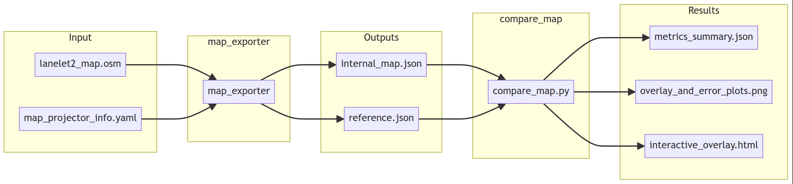

### データフロー

| 段階 | 説明 |
|------|------|
| **Input** | Lanelet2形式のマップ（`.osm`）および投影情報（`map_projector_info.yaml`） |
| **map_exporter** | マップを読み込み、Diffusion Planner用の内部形式に変換します。同時に「参照用」の生データも出力します。 |
| **compare_map** | 内部形式（変換後）と参照用（生データ）を比較し、幾何学的な誤差を算出します。 |
| **Results** | メトリクス、可視化プロット、およびインタラクティブHTMLダッシュボードを出力します。 |

---

## 2. 前提条件

### 必要なファイル構成

マップディレクトリには以下の2つのファイルが必要です。

```text
マップディレクトリ/
├── lanelet2_map.osm          # Lanelet2形式のベクターマップ
└── map_projector_info.yaml   # 投影方式の設定（MGRSまたはTransverseMercator）
```

### `map_projector_info.yaml` の設定例

**MGRS形式の場合：**
```yaml
projector_type: MGRS
vertical_datum: WGS84
mgrs_grid: 54SUE
```

**TransverseMercator形式の場合：**
```yaml
projector_type: TransverseMercator
vertical_datum: WGS84
map_origin:
  latitude: 35.674438
  longitude: 139.747333
  altitude: 0
```

### Pythonの依存関係

```bash
pip install numpy matplotlib jinja2
```

### CPPツールのビルド

```bash
git clone git@github.com:tier4/Diffusion-Planner.git
cd cpp_tools
bash prepare_repos.sh
bash build.sh
```

---

## 3. 使い方

### 3.1 ワンショット実行（推奨）

マップのエクスポートから評価までを一括で行う方法です。

```bash
# ワークスペースのルート（Diffusion-Planner）から実行します
source cpp_tools/install/setup.bash
python3 cpp_tools/src/autoware_diffusion_planner_tools/scripts/map_eval/compare_map.py \
    export-eval \
    --map_path \
    /path/to/your/map/lanelet2_map.osm \
    --out_dir ./map_eval_result \
    --lane_threshold 0.5 \
    --line_threshold 0.5 \
    --web
```

- `--map_path` : Lanelet2マップ（`.osm`）へのパスを指定します。
- `--out_dir` : 評価結果の出力先ディレクトリを指定します。
- `--web` : 計算完了後、自動的にブラウザでインタラクティブHTMLを起動します（推奨）。

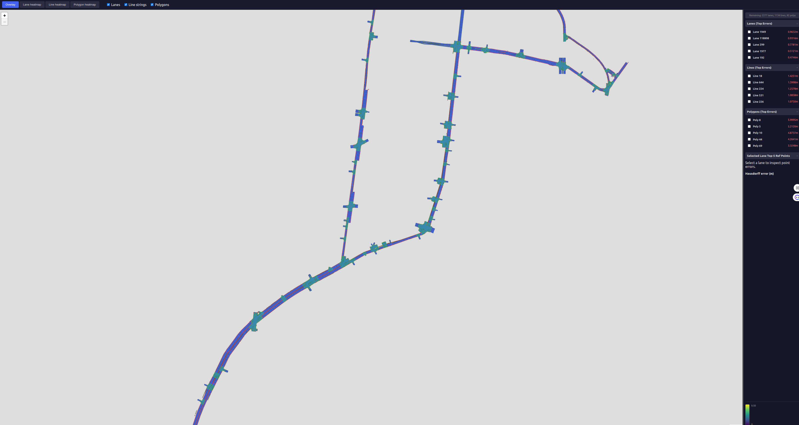

---

## 4. UI の使い方

### 4.1 Laneletの評価

`--web` オプションを使用して実行すると、計算の完了後に自動でブラウザが起動します。

| 操作・表示 | 画面例 |
|---|---|
| 画面左上で「Lane heatmap」または「Line heatmap」を切り替えることができます。<br><br>Laneletの誤差を確認する場合は、**Lane heatmap**を選択してください。 | 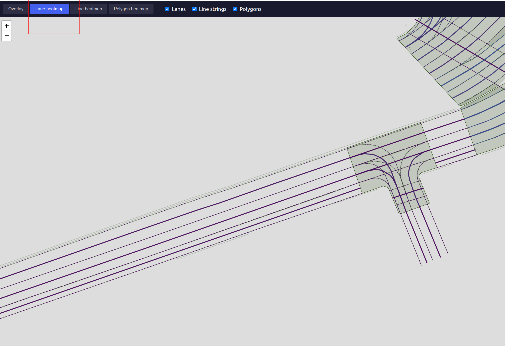 |
| 画面右側には、誤差の大きいLaneletやLineStringのIDがリスト表示されます。<br>該当するIDをクリックすると、マップ上で自動的にその位置へズーム（拡大）されます。 | 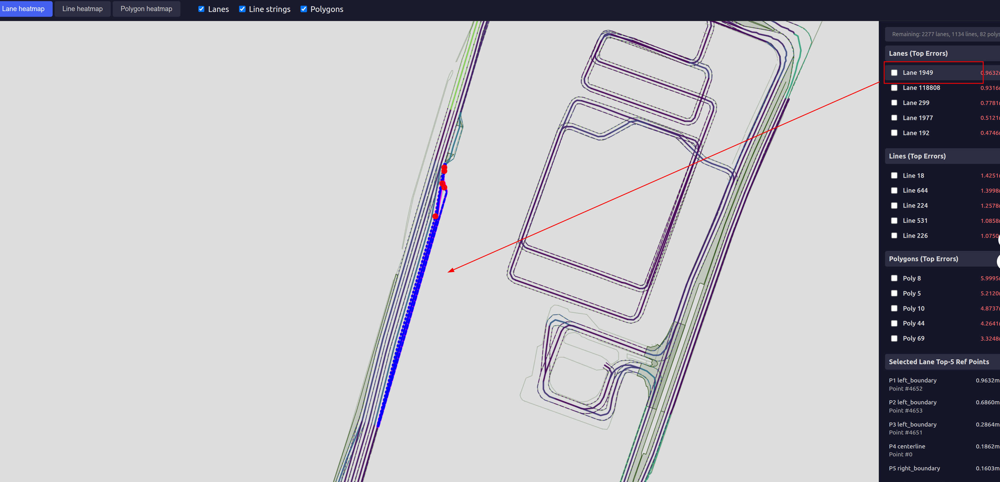 |
| マップ上の赤い点を選択すると、実際の誤差（エラー値）を確認できます。<br>🔴 赤い点：DP近似点<br>🔵 青い点：元の地図上の点 <br><br> **修正方法**：VectorMapBuilder等を使用して、該当するLaneletを**適切に分割**してください。分割により、DPの近似精度が向上します。 | 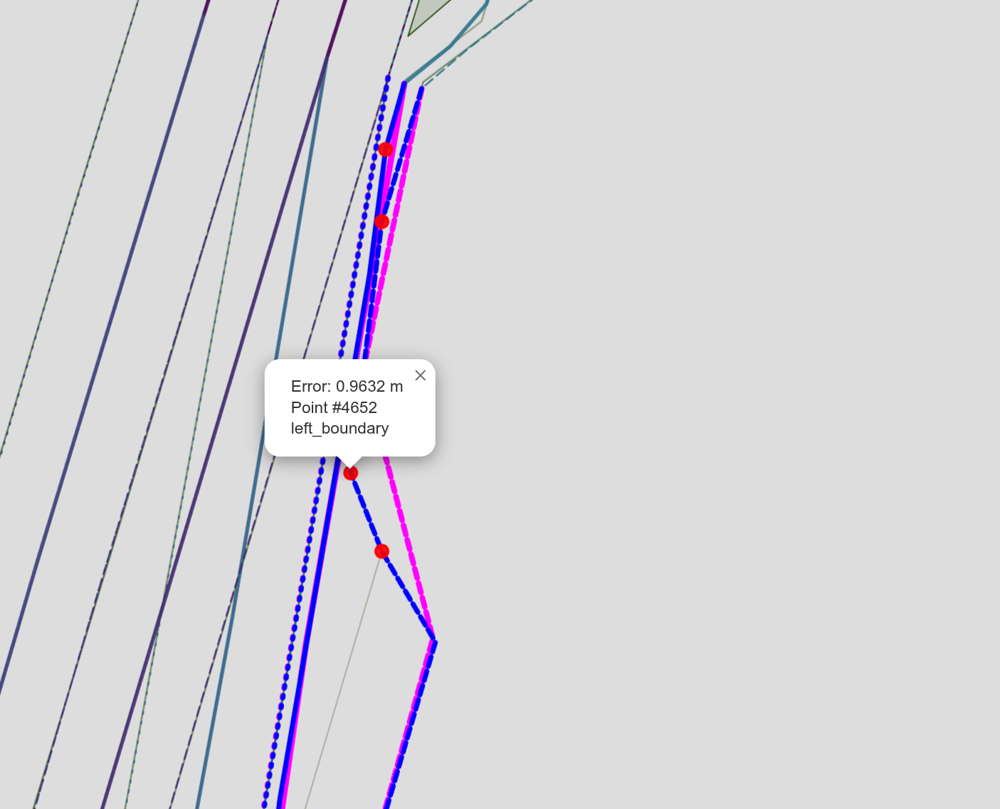 |
| 修正が完了したもの、交差点内などで分割が困難なもの、あるいは修正不要と判断したLaneletについては、作業者の判断で対応してください。<br>リストのチェックボックスをクリックすると、現在のセッション中は該当のLaneletを一時的に非表示にできます（画面を再読み込みすると元に戻ります）。 | 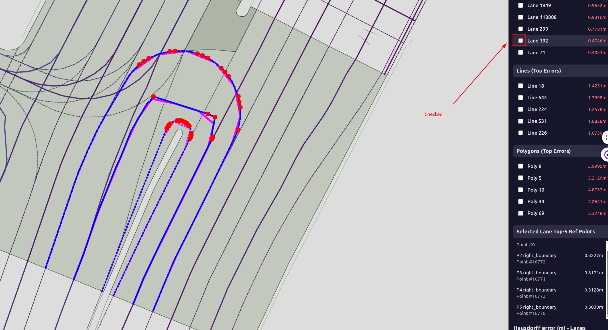 |
| 確認済みの要素を非表示にすることで、次に誤差の大きいレーンの検証をスムーズに行うことができます。 | 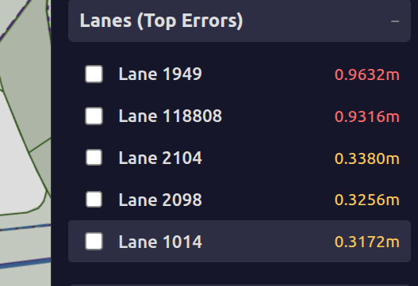 |

#### Laneletの判断例：

| 画像例 | 対応 |
|------|------|
| 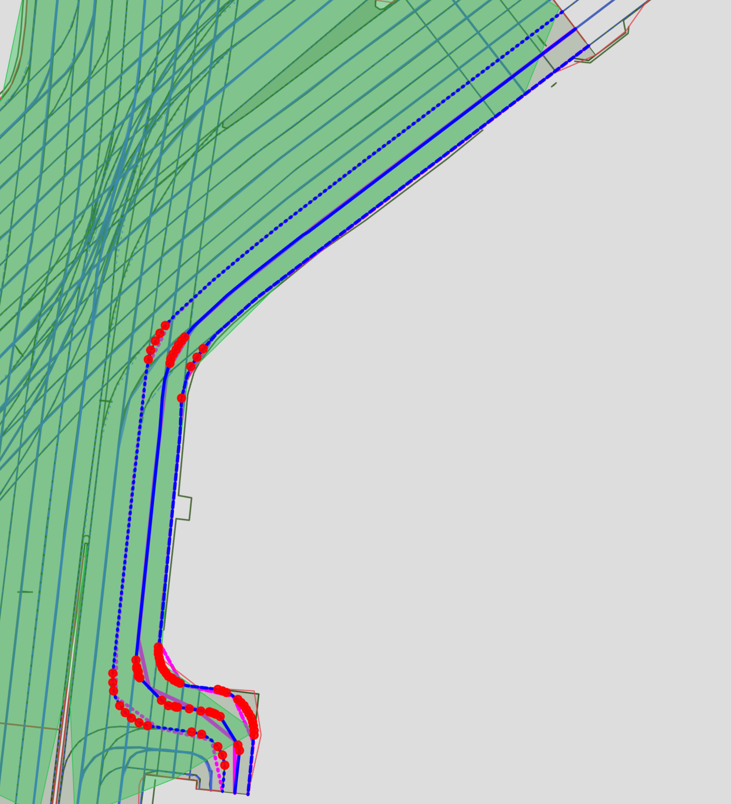 | **対応が必要:** 連続するカーブが1つのレーンとして結合されているため、分割して修正すべき箇所です。 |
| 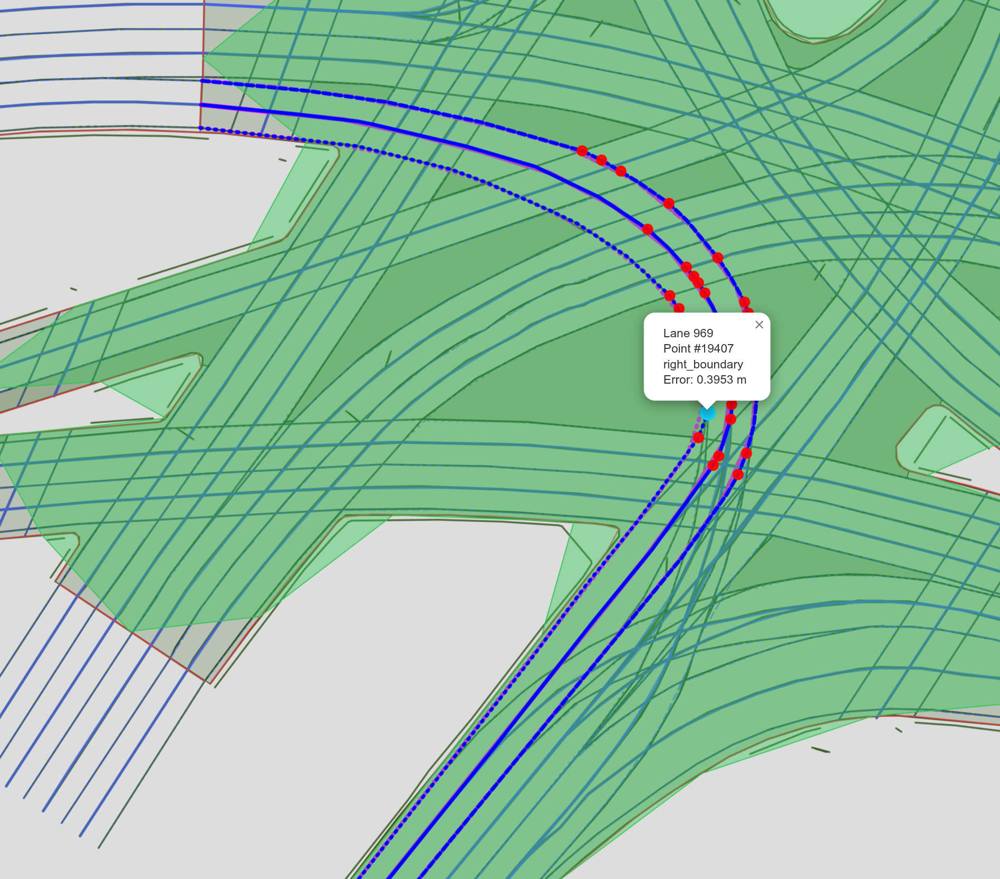 | **無理な分割は控える:** このような交差点内のカーブは自動運転の挙動に影響を与える可能性があるため、無理な分割は控え、報告事項として記録してください。 |

---

### 4.2 LineStringの評価

| 操作・表示 | 画面例 |
|---|---|
| LineStringを確認する場合は、**Line heatmap**を選択してください。<br>Laneletと同様に、右側の「Top Error Lines」から該当IDをクリックして確認します。<br>🔴 赤い点：DP近似点<br>🔵 青い点：元の地図上の点 | 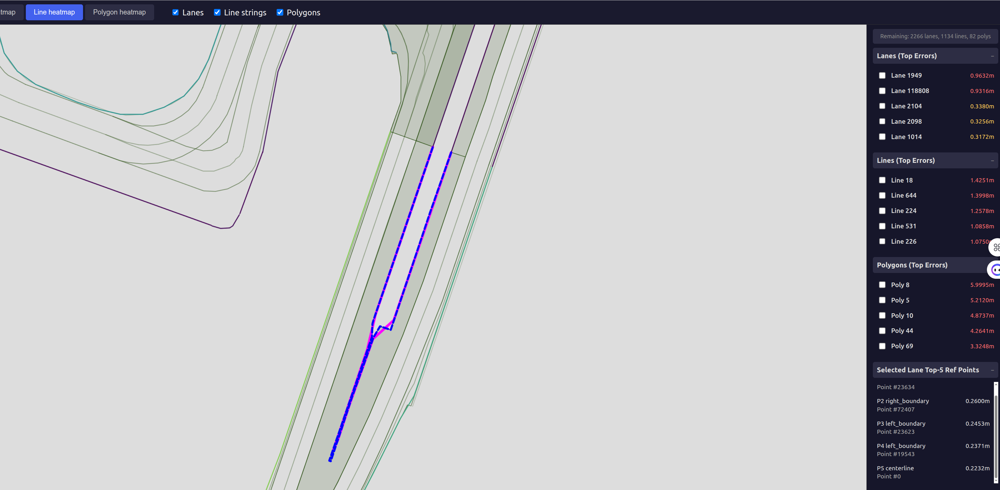 |

**修正方法**: VectorMapBuilder等を使用して、該当するLineStringを**適切に分割**してください。

**判断の目安**: 直線の道路など、誤差が走行に影響しない箇所もあります。修正の要否は作業者の判断に委ねられます。

#### LineStringの判断例：

| 画像例 | 対応 |
|------|------|
| 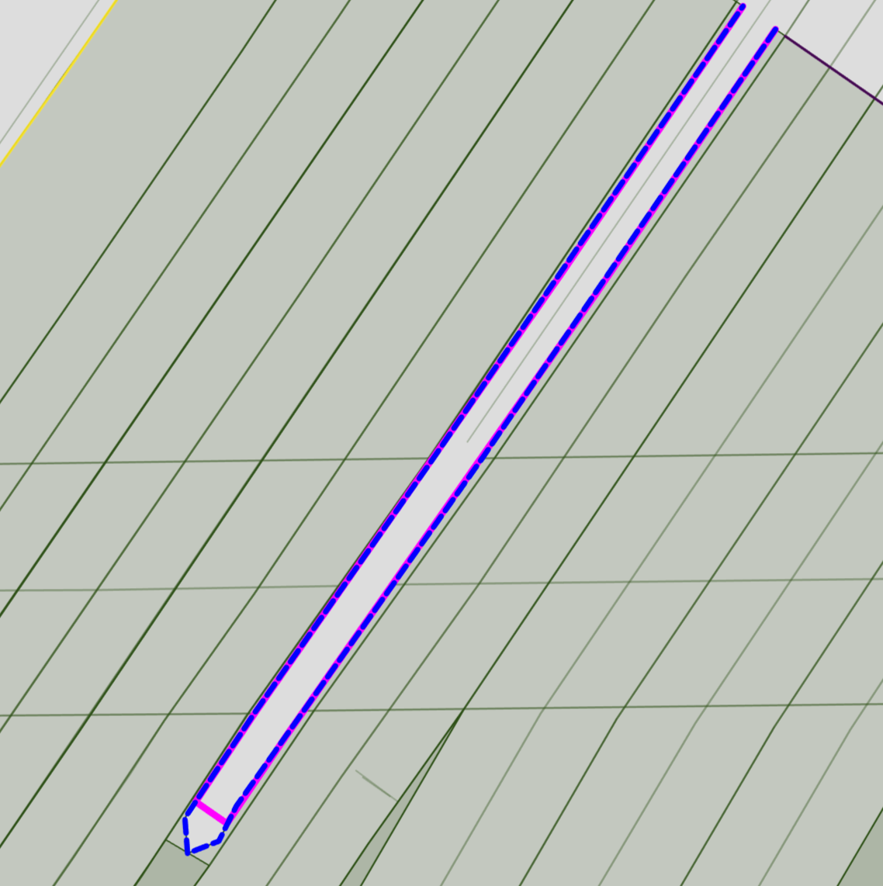 | **対応が必要:** 境界線（Border）がショートカットされる形で近似されてしまっているため、修正が必要です。 |
| 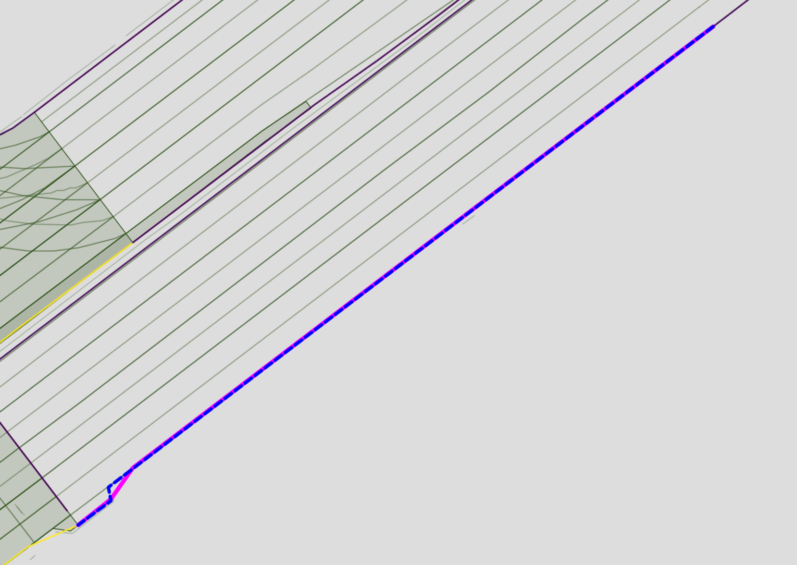 | **修正不要:** 走行への影響が少ない直線上の境界線（Border）であるため、修正しなくても問題ありません。 |

---

## 5. ホットスポット修正のワークフロー

1. **評価の実行**（`--web` オプションでブラウザを自動起動）
2. **Lane heatmap** でレーンのホットスポット（誤差が大きい箇所）を確認します。
    - 黄色く表示された箇所をズームし、DPによる近似と元の地図とのズレを確認します。
    - 該当のLaneletを適切に分割します（※交差点の右折レーンなどは無理に分割する必要はありません）。
3. **Line heatmap** で Road border のホットスポットを確認します。
    - 黄色く表示された箇所をズームし、Road border の近似誤差を確認します。
    - 該当のLineStringを適切に分割します（※直線の道路など、影響が小さい箇所の修正は任意です）。
4. **マップの編集・再エクスポート**
    ```bash
    python3 .../compare_map.py export-eval \
    --map_path /path/to/edited_map/lanelet2_map.osm \
    --out_dir ./map_eval_after_edit \
    --lane_threshold 0.5 --line_threshold 0.5 \
    --web
    ```
5. **再評価して改善を確認**
    - 出力された `metrics_summary.json` を確認し、`pass_rate` や `Hausdorff` の値が改善しているかをチェックします。

---

## 6. よくあるトラブル

### `map_projector_info.yaml` が見つからない

`lanelet2_map.osm` と同じディレクトリ階層に `map_projector_info.yaml` が配置されているか確認してください。